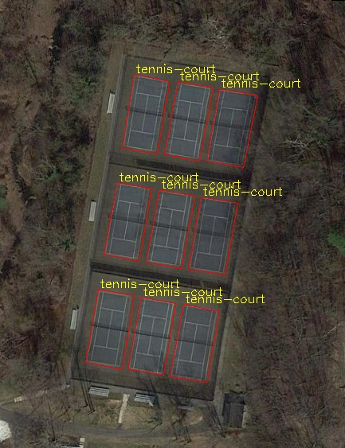
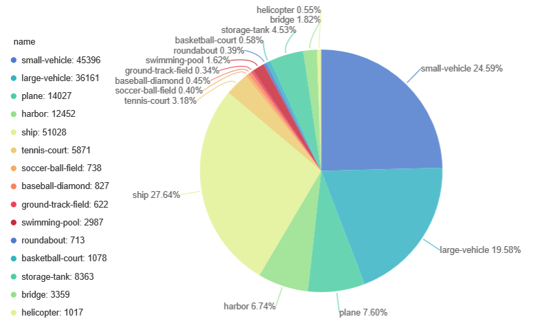

========
标签分析
========

目前仅提供COCO格式标签分析，其它格式数据集需先转为COCO格式（或与COCO兼容的格式）才能使用此库分析。

COCO格式标签分析
================

加载COCO格式标签

.. code-block::

    import cvtools

    # imgage folder
    img_prefix = '/media/data/DOTA/train/images'
    # position you save in dataset convertion.
    ann_file = '../label_convert/dota/train_dota_x1y1wh_polygen.json'
    coco_analysis = cvtools.COCOAnalysis(img_prefix, ann_file)

可视化标签
----------

支持绘制bbox和segmentation，可以指定bbox格式。

bbox格式支持：

- x1y1wh(默认)
- polygon(segmentation模式使用)

.. code-block::

    # 接上
    save = 'dota/vis_dota_whole/'
    coco_analysis.vis_instances(save,
                                vis='segmentation',
                                box_format='polygon')

结果示例：

实例数多维度统计
----------------

按size和类别维度
^^^^^^^^^^^^^^^^

统计每个类别不同size占比和数量，size定义同COCO

.. code-block::

    # 接上
    # Size distribution analysis for each category
    save = 'size_per_cat_data.json'
    coco_analysis.stats_size_per_cat(save)

结果示例：

.. raw:: html

    <html>
      <head>
        <meta charset="utf-8">
        <title>层叠柱状图</title>
        
        
      </head>
      <body>
        

        
      </body>
    </html>

按图片维度
^^^^^^^^^^

统计每个类别单张图平均有多少实例数，统计维度是图片

.. code-block::

    # 接上
    # Average number of targets per image for each category
    save = 'stats_num.json'
    coco_analysis.stats_objs_per_img(save)

结果示例

.. code::

    {
        "plane": 40.46192893401015,
        "large-vehicle": 44.65526315789474,
        "small-vehicle": 53.757201646090539,
        "ship": 86.09815950920246,
        "harbor": 17.64896755162242,
        "ground-track-field": 1.8361581920903956,
        "soccer-ball-field": 2.3970588235294119,
        "tennis-court": 7.837748344370861,
        "baseball-diamond": 3.401639344262295,
        "swimming-pool": 12.055555555555556,
        "roundabout": 2.347058823529412,
        "basketball-court": 4.63963963963964,
        "storage-tank": 31.236024844720498,
        "bridge": 9.747619047619047,
        "helicopter": 21.0,
        "total": 70.09638554216868
    }

按类别维度
^^^^^^^^^^

统计每个类别有多少实例数，统计维度是类别。其结果一般用于训练时样本非均衡采样比例参考。

.. code-block::

    # 接上
    # Analysis of target quantity per category
    save = 'objs_per_cat_data.json'
    coco_analysis.stats_objs_per_cat(save)

结果示例：

