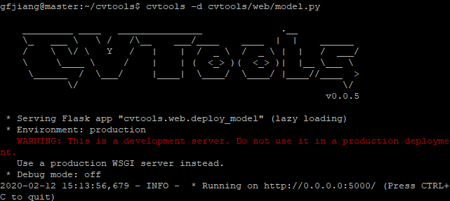
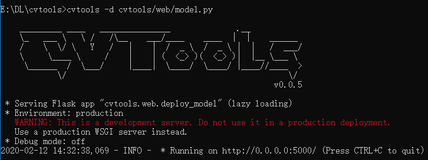

## 模型部署

### 服务器端部署模型

模型在服务器上训练，部署到服务器上也相对容易，一般只需要配置一个能够进行推断的最小环境（精简版训练环境）的dockerfile文件，
然后修改测试代码，约定模型对外输出格式，通过web接口调用，实现调用、推断环境分离，使用户不需要拥有模型的训练环境便可使用模型。

CVTools目标是最小化对训练用代码的修改，使其容易部署。CVTools内部使用Flask Web框架，对外提供Restful形式接口。
使用命令行方式部署模型，命令如下：

```
cvtools -d model.py

```

默认使用5000端口，可使用`-p`参数指定，Web日志以及临时文件默认输出到当前目录deploy文件夹中下，可使用-l参数指定。正确的运行结果如下：

Linux系统



Windows系统



完整命令如下：

```
cvtools -d model.py -p 666 -l deploy/model.log
```

-d指定的模型py代码，路径可使用相对路径，相对于cvtools命令使用的路径。模型代码必须提供`model`对象，必须有detect方法，即可以继承
`cvtools.web.model.Model`类

```python
class Model(object):
    """Just as an interface, you have to implement specific model code"""

    def detect(self, img):
        raise NotImplementedError("detect is not implemented!")

    def prase_results(self, results):
        return results

    def draw(self, img, results):
        return img


model = Model()
```

CVTools提供以下Web接口：

- ip:port: 浏览器操作。选择待检测图片，返回模型draw方法结果。
- ip:port/detect: API。调用模型的detect方法，返回结果。Python调用代码示例如下：

```python
import requests


REST_API_URL = 'http://localhost:666/detect'


image_path = "path/to/image"
# Initialize image path
image = open(image_path, 'rb').read()
form = {'filename': image_path}  # 非必须
multipart = {'image': image}  # 必须有的参数

# Submit the request.
r = requests.post(REST_API_URL, data=form, files=multipart).json()

# Ensure the request was successful.
if r['success']:
    # Loop over the predictions and display them.
    print(r['results'])
# Otherwise, the request failed.
else:
    print('Request failed')
```

- ip:port/show/<string:filename>: 浏览器操作。在浏览器中查看服务器后台已检测的图片

Note:
- 接口名称和数量可能会变化，会保持此页面更新。